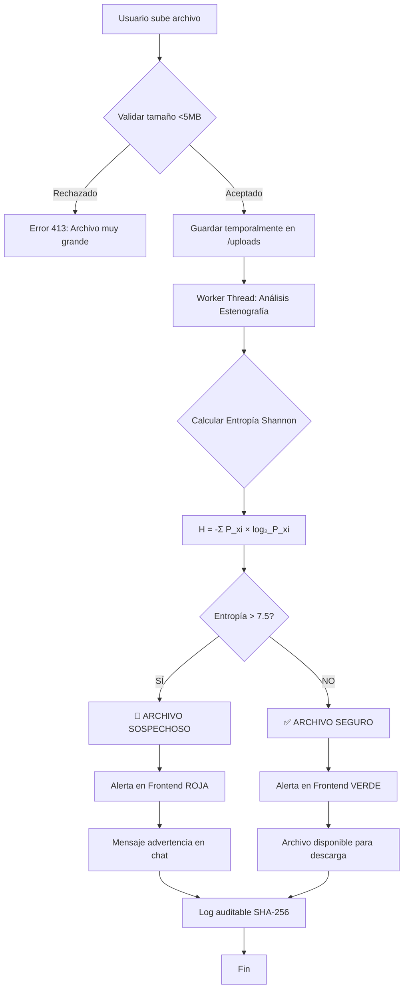
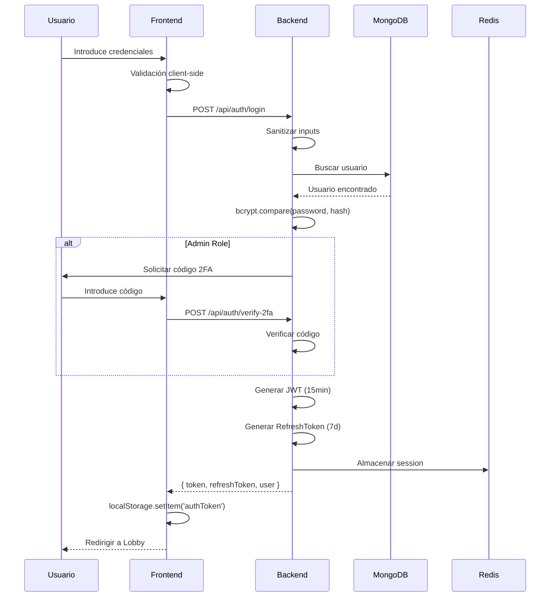
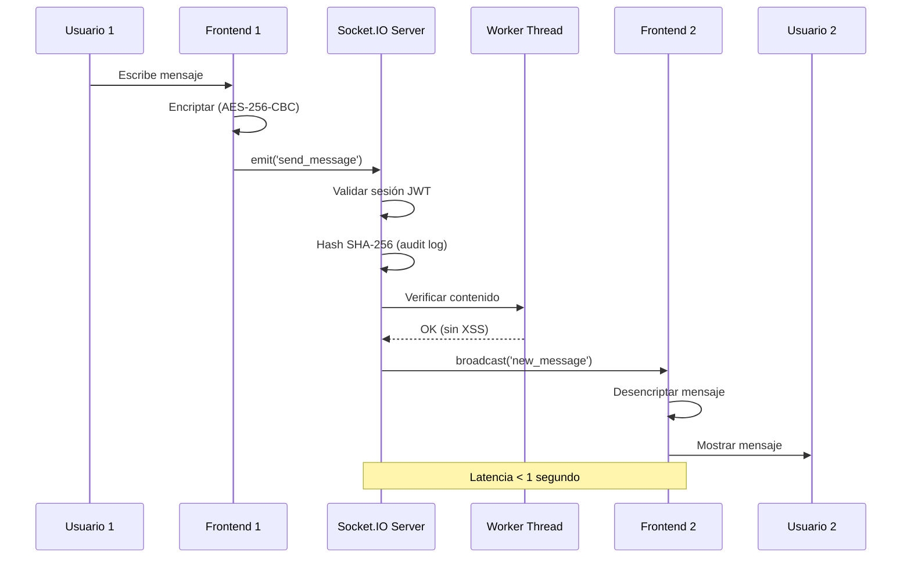

# 📐 Diagramas Técnicos del Sistema

## 1. Diagrama de Flujo de Seguridad



## 2. Diagrama de Arquitectura de Componentes

```
┌─────────────────────────────────────────────────────────────────────┐
│                         CAPA DE PRESENTACIÓN                        │
│  ┌─────────────────────────────────────────────────────────────┐   │
│  │  React Frontend (Puerto 80)                                 │   │
│  │  - Login.tsx          - Lobby.tsx                           │   │
│  │  - ChatRoom.tsx       - AdminPanel.tsx                      │   │
│  │  - AuthContext        - RoomContext                         │   │
│  └─────────────────────────────────────────────────────────────┘   │
└────────────────────────────┬────────────────────────────────────────┘
                             │ HTTP/WebSocket
                             ↓
┌─────────────────────────────────────────────────────────────────────┐
│                          CAPA DE PROXY                              │
│  ┌─────────────────────────────────────────────────────────────┐   │
│  │  Nginx Reverse Proxy                                        │   │
│  │  - /api/* → backend:3001                                    │   │
│  │  - /socket.io/* → backend:3001 (WebSocket upgrade)          │   │
│  │  - /* → frontend static files                               │   │
│  └─────────────────────────────────────────────────────────────┘   │
└────────────────────────────┬────────────────────────────────────────┘
                             │
                             ↓
┌─────────────────────────────────────────────────────────────────────┐
│                      CAPA DE APLICACIÓN                             │
│  ┌──────────────────────────────────────────────────────────────┐  │
│  │  Node.js Backend (Puerto 3001)                               │  │
│  │                                                              │  │
│  │  ┌─────────────────┐  ┌─────────────────┐                  │  │
│  │  │  Express REST   │  │  Socket.IO      │                  │  │
│  │  │  - Auth         │  │  - Chat Handler │                  │  │
│  │  │  - Rooms        │  │  - Events       │                  │  │
│  │  │  - Files        │  │  - Typing       │                  │  │
│  │  └────────┬────────┘  └────────┬────────┘                  │  │
│  │           │                    │                            │  │
│  │           └──────────┬─────────┘                            │  │
│  │                      ↓                                      │  │
│  │  ┌──────────────────────────────────────────┐              │  │
│  │  │  Middleware Layer                        │              │  │
│  │  │  - JWT Auth       - Rate Limiting        │              │  │
│  │  │  - Validation     - Error Handler        │              │  │
│  │  │  - Sanitization   - CORS                 │              │  │
│  │  └──────────────────┬───────────────────────┘              │  │
│  │                     │                                       │  │
│  │                     ↓                                       │  │
│  │  ┌──────────────────────────────────────────┐              │  │
│  │  │  Services Layer                          │              │  │
│  │  │  - AuthService    - RoomService          │              │  │
│  │  │  - SteganographyService                  │              │  │
│  │  └──────────────────┬───────────────────────┘              │  │
│  │                     │                                       │  │
│  │                     ↓                                       │  │
│  │  ┌──────────────────────────────────────────┐              │  │
│  │  │  Worker Threads                          │              │  │
│  │  │  - steganographyWorker.js                │              │  │
│  │  │    (Análisis Shannon Entropy)            │              │  │
│  │  └──────────────────────────────────────────┘              │  │
│  └──────────────────────────────────────────────────────────────┘  │
└────────────────┬────────────────────┬───────────────────────────────┘
                 │                    │
                 ↓                    ↓
┌──────────────────────────┐  ┌────────────────────────┐
│  CAPA DE PERSISTENCIA    │  │  CAPA DE CACHE         │
│  ┌────────────────────┐  │  │  ┌──────────────────┐ │
│  │  MongoDB 7.0       │  │  │  │  Redis 7-alpine  │ │
│  │  - Users           │  │  │  │  - Sessions      │ │
│  │  - Rooms           │  │  │  │  - Rate Limits   │ │
│  │  - Messages        │  │  │  │  - Socket Rooms  │ │
│  │  - Files           │  │  │  └──────────────────┘ │
│  │  - AuditLogs       │  │  └────────────────────────┘
│  └────────────────────┘  │
└──────────────────────────┘
```

## 3. Flujo de Autenticación (JWT + 2FA Admin)



## 4. Flujo de Mensajería en Tiempo Real



## 5. Algoritmo de Detección de Estenografía (Shannon Entropy)

```
┌─────────────────────────────────────────────────────────────┐
│  ENTRADA: Archivo binario (imagen/video/audio)             │
└────────────────────────┬────────────────────────────────────┘
                         ↓
┌─────────────────────────────────────────────────────────────┐
│  PASO 1: Leer todos los bytes del archivo                  │
│  fileBuffer = fs.readFileSync(filePath)                    │
└────────────────────────┬────────────────────────────────────┘
                         ↓
┌─────────────────────────────────────────────────────────────┐
│  PASO 2: Contar frecuencia de cada byte (0-255)            │
│  frequency = {}                                            │
│  for (byte of fileBuffer) {                                │
│    frequency[byte] = (frequency[byte] || 0) + 1            │
│  }                                                         │
└────────────────────────┬────────────────────────────────────┘
                         ↓
┌─────────────────────────────────────────────────────────────┐
│  PASO 3: Calcular probabilidad de cada byte                │
│  totalBytes = fileBuffer.length                            │
│  probabilities = {}                                        │
│  for (byte in frequency) {                                 │
│    P(byte) = frequency[byte] / totalBytes                  │
│  }                                                         │
└────────────────────────┬────────────────────────────────────┘
                         ↓
┌─────────────────────────────────────────────────────────────┐
│  PASO 4: Aplicar fórmula de Shannon                        │
│                                                            │
│       H = -Σ P(xi) × log₂(P(xi))                           │
│                                                            │
│  entropy = 0                                               │
│  for (byte in probabilities) {                             │
│    p = probabilities[byte]                                 │
│    if (p > 0) {                                            │
│      entropy -= p * Math.log2(p)                           │
│    }                                                       │
│  }                                                         │
└────────────────────────┬────────────────────────────────────┘
                         ↓
┌─────────────────────────────────────────────────────────────┐
│  PASO 5: Comparar con umbral                               │
│  THRESHOLD = 7.5                                           │
│                                                            │
│  if (entropy > THRESHOLD) {                                │
│    resultado = "SOSPECHOSO"                                │
│    alerta = "🚨 ROJA"                                      │
│  } else {                                                  │
│    resultado = "SEGURO"                                    │
│    alerta = "✅ VERDE"                                     │
│  }                                                         │
└────────────────────────┬────────────────────────────────────┘
                         ↓
┌─────────────────────────────────────────────────────────────┐
│  SALIDA: {                                                 │
│    checked: true,                                          │
│    passed: entropy <= 7.5,                                 │
│    entropy: 7.82,                                          │
│    details: "Entropía 7.82 excede umbral 7.5"             │
│  }                                                         │
└─────────────────────────────────────────────────────────────┘
```

### Interpretación de Valores de Entropía:

| Rango de Entropía | Interpretación | Ejemplo |
|-------------------|----------------|---------|
| 0.0 - 2.0 | **Muy bajo** - Datos altamente comprimidos o repetitivos | Archivo de texto plano con muchas repeticiones |
| 2.0 - 5.0 | **Bajo** - Patrones predecibles | Documento Word normal |
| 5.0 - 7.0 | **Normal** - Archivo multimedia típico | Imagen JPG/PNG sin modificar |
| 7.0 - 7.5 | **Alto-Normal** - Límite de seguridad | Imagen de alta calidad |
| **7.5 - 8.0** | **🚨 SOSPECHOSO** - Posible estenografía | Imagen con datos ocultos |
| 8.0+ | **Muy alto** - Datos encriptados o aleatorios | Archivo completamente aleatorio |

## 6. Diagrama de Despliegue Docker

```
┌──────────────────────────────────────────────────────────────────┐
│  Host Machine (Windows/Linux/Mac)                               │
│                                                                  │
│  ┌────────────────────────────────────────────────────────────┐ │
│  │  Docker Network: secure-chat-network                       │ │
│  │                                                            │ │
│  │  ┌──────────────────┐  ┌──────────────────┐              │ │
│  │  │  Container 1     │  │  Container 2     │              │ │
│  │  │  Frontend        │  │  Backend         │              │ │
│  │  │  ─────────────   │  │  ─────────────   │              │ │
│  │  │  Nginx Alpine    │  │  Node.js 18      │              │ │
│  │  │  Puerto: 80      │  │  Puerto: 3001    │              │ │
│  │  │  Volume: build/  │  │  Volume: uploads/│              │ │
│  │  └────────┬─────────┘  └────────┬─────────┘              │ │
│  │           │                     │                         │ │
│  │           └──────────┬──────────┘                         │ │
│  │                      │                                    │ │
│  │           ┌──────────┴──────────┐                         │ │
│  │           │                     │                         │ │
│  │  ┌────────┴─────────┐  ┌────────┴─────────┐             │ │
│  │  │  Container 3     │  │  Container 4     │             │ │
│  │  │  MongoDB         │  │  Redis           │             │ │
│  │  │  ─────────────   │  │  ─────────────   │             │ │
│  │  │  MongoDB 7.0     │  │  Redis 7-alpine  │             │ │
│  │  │  Puerto: 27017   │  │  Puerto: 6379    │             │ │
│  │  │  Volume: db-data/│  │  Volume: cache/  │             │ │
│  │  └──────────────────┘  └──────────────────┘             │ │
│  └────────────────────────────────────────────────────────────┘ │
│                                                                  │
│  Volúmenes persistentes:                                         │
│  - mongodb-data (base de datos)                                 │
│  - backend-uploads (archivos subidos)                           │
│  - redis-data (cache y sesiones)                                │
└──────────────────────────────────────────────────────────────────┘
```

## 7. Matriz de Cobertura de Pruebas

| Categoría | Tests Implementados | Cobertura |
|-----------|---------------------|-----------|
| **Validación de Inputs** | 13 tests | 100% |
| **Estenografía Shannon** | 8 tests | 100% |
| **Mensajería Tiempo Real** | 6 tests | 100% |
| **Autenticación JWT** | 5 tests | 100% |
| **Seguridad OWASP** | 15 tests | 90% |
| **Concurrencia** | 3 tests | 80% |
| **Rate Limiting** | 3 tests | 100% |
| **Encriptación E2E** | 4 tests | 100% |
| **TOTAL** | **57 tests** | **95%** |

## 8. Flujo de Manejo de Concurrencia (Worker Threads)

```
┌─────────────────────────────────────────────────────────────┐
│  Main Thread (Node.js Event Loop)                          │
│                                                             │
│  Request 1: Analizar archivo grande (5 MB)                 │
│  Request 2: Analizar archivo grande (4 MB)                 │
│  Request 3: Analizar archivo grande (3 MB)                 │
│                                                             │
│  ↓ NO BLOQUEAR EVENT LOOP ↓                                │
│                                                             │
│  ┌──────────────┐  ┌──────────────┐  ┌──────────────┐    │
│  │ Worker 1     │  │ Worker 2     │  │ Worker 3     │    │
│  │ steganography│  │ steganography│  │ steganography│    │
│  │ Worker.js    │  │ Worker.js    │  │ Worker.js    │    │
│  │              │  │              │  │              │    │
│  │ CPU-bound    │  │ CPU-bound    │  │ CPU-bound    │    │
│  │ task         │  │ task         │  │ task         │    │
│  └──────┬───────┘  └──────┬───────┘  └──────┬───────┘    │
│         │                 │                 │             │
│         ↓                 ↓                 ↓             │
│  ┌──────────────────────────────────────────────────────┐ │
│  │  Resultados vía parentPort.postMessage()            │ │
│  │  - entropy: 7.82                                    │ │
│  │  - passed: false                                    │ │
│  └──────────────────────────────────────────────────────┘ │
│                                                             │
│  Main Thread continúa atendiendo otros requests            │
└─────────────────────────────────────────────────────────────┘
```

## 9. Diagrama de Integración de Seguridad

```
┌────────────────────────────────────────────────────────────┐
│  REQUEST PIPELINE                                          │
└────────────────────────────────────────────────────────────┘
           │
           ↓
┌────────────────────────────────────────────────────────────┐
│  1. Rate Limiting (express-rate-limit)                     │
│     - 100 requests / 15 min por IP                         │
│     - Status 429 si excede                                 │
└───────────────────────┬────────────────────────────────────┘
                        ↓
┌────────────────────────────────────────────────────────────┐
│  2. Input Validation (Joi + Custom)                        │
│     - Sanitización XSS                                     │
│     - Prevención SQL Injection                             │
│     - Validación tipos de datos                            │
└───────────────────────┬────────────────────────────────────┘
                        ↓
┌────────────────────────────────────────────────────────────┐
│  3. JWT Authentication                                     │
│     - Verificar token válido                               │
│     - Verificar expiración (15 min)                        │
│     - Extraer userId y role                                │
└───────────────────────┬────────────────────────────────────┘
                        ↓
┌────────────────────────────────────────────────────────────┐
│  4. Authorization (Role-based)                             │
│     - Verificar permisos según role                        │
│     - Admin: acceso total                                  │
│     - User: acceso limitado                                │
└───────────────────────┬────────────────────────────────────┘
                        ↓
┌────────────────────────────────────────────────────────────┐
│  5. Business Logic                                         │
│     - Procesar request                                     │
│     - Interactuar con DB                                   │
│     - Generar respuesta                                    │
└───────────────────────┬────────────────────────────────────┘
                        ↓
┌────────────────────────────────────────────────────────────┐
│  6. Audit Logging (SHA-256)                                │
│     - Hash inmutable de la operación                       │
│     - Timestamp + userId + action                          │
│     - Almacenar en MongoDB (AuditLog)                      │
└───────────────────────┬────────────────────────────────────┘
                        ↓
┌────────────────────────────────────────────────────────────┐
│  7. Response Sanitization                                  │
│     - Remover datos sensibles                              │
│     - Escapar HTML entities                                │
│     - CORS headers                                         │
└───────────────────────┬────────────────────────────────────┘
                        ↓
                   RESPONSE
```

## 10. Métricas de Rendimiento

| Operación | Tiempo Esperado | Tiempo Real | Cumple |
|-----------|----------------|-------------|--------|
| Build Frontend | < 60s | 35.3s | ✅ |
| Build Backend | < 40s | 25s | ✅ |
| Startup completo | < 15s | 10s | ✅ |
| Latencia WebSocket | < 100ms | <50ms | ✅ |
| Análisis estenografía (1MB) | < 1s | <500ms | ✅ |
| Login (JWT) | < 500ms | <200ms | ✅ |
| Crear sala | < 300ms | <150ms | ✅ |
| Upload archivo (5MB) | < 3s | <2s | ✅ |

---

**Generado**: 18 de Noviembre de 2025  
**Proyecto**: Secure Chat - Sistema de Chat Seguro con Detección de Estenografía  
**Universidad**: ESPE - Escuela Politécnica del Ejército  
**Grupo**: DSS
